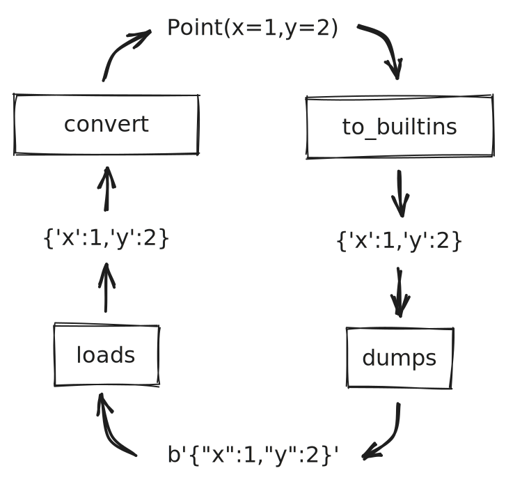

Converters
==========

.. currentmodule:: msgspec

``msgspec`` provides builtin support for several common protocols (``json``,
``msgpack``, ``yaml``, and ``toml``). Support for additional protocols may be
added by combining a serialization library with msgspec's *converter
functions*: `msgspec.to_builtins` and `msgspec.from_builtins`.

- `msgspec.to_builtins`: takes an object composed of any type msgspec supports
  and converts it into one composed of only simple builtin types typically
  supported by Python serialization libraries.

- `msgspec.from_builtins`: takes an object composed of simple builtin types
  typically supported by Python serialization libraries, and converts it into a
  object composed of any type msgspec supports (validating along the way). If
  the conversion fails due to a schema mismatch, a nice error message is
  raised.

These functions are designed to be paired with a Python serialization library as
pre/post processors for typical ``dumps`` and ``loads`` functions.

For example, if ``msgspec`` didn't already provide support for ``json``, you
could add support by wrapping the standard library's `json` module as follows:

.. code-block:: ipython

    In [1]: import json
       ...: from typing import Any
       ...:
       ...: import msgspec

    In [2]: def encode(obj):
       ...:     return json.dumps(msgspec.to_builtins(obj))

    In [3]: def decode(msg, type=Any):
       ...:     return msgspec.from_builtins(json.loads(msg), type=type)

    In [4]: class Point(msgspec.Struct):
       ...:     x: int
       ...:     y: int

    In [5]: x = Point(1, 2)

    In [6]: msg = encode(x)  # Encoding a high-level type works

    In [7]: msg
    '{"x": 1, "y": 2}'

    In [8]: decode(msg, type=Point)  # Decoding a high-level type works
    Point(x=1, y=2)

    In [9]: decode('{"x": "oops", "y": 2}', type=Point)  # Schema mismatches error
    ---------------------------------------------------------------------------
    ValidationError                           Traceback (most recent call last)
    Cell In[9], line 1
    ----> 1 decode('{"x": "oops", "y": 2}', type=Point)  # Schema mismatches error

    Cell In[3], line 2, in decode(msg, type)
         1 def decode(msg, type=Any):
    ---> 2     return msgspec.from_builtins(json.loads(msg), type=type)

    ValidationError: Expected `int`, got `str` - at `$.x`

Since all protocols are different, `to_builtins` and `from_builtins` have a few
configuration options:

- ``builtin_types``: an iterable of additional types to treat as builtin types,
  beyond the standard `dict`, `list`, `tuple`, `set`, `frozenset`, `str`,
  `int`, `float`, `bool`, and `None`.

- ``str_keys``: whether the wrapped protocol only supports strings for object
  keys, rather than any hashable type.

- ``str_values``: `from_builtins` only. Whether the wrapped protocol only
  supports string values. This is useful for completely untyped protocols like
  URL querystrings, where only string values exist.

- ``enc_hook``/``dec_hook``: the standard keyword arguments used for
  :doc:`extending` msgspec to support additional types.

Taking a look at another protocol - TOML_. This protocol

- Includes native support for `datetime.datetime`, `datetime.date`, and
  `datetime.time` types.
- Only supports strings for object keys.

If ``msgspec`` didn't already provide support for ``toml``, you could add
support by wrapping the standard library's `tomllib` module as follows:

.. code-block:: python

    import datetime
    import tomllib
    from typing import Any

    import msgspec

    def decode(msg, *, type=Any, dec_hook=None):
        return msgspec.from_builtins(
            toml.loads(msg),
            type,
            builtin_types=(datetime.datetime, datetime.date, datetime.time),
            str_keys=True,
            dec_hook=dec_hook,
        )

``msgspec`` uses these APIs to implement ``toml`` and ``yaml`` support,
wrapping external serialization libraries:

- ``msgspec.toml`` (`code <https://github.com/jcrist/msgspec/blob/main/msgspec/toml.py>`__)

- ``msgspec.yaml`` (`code <https://github.com/jcrist/msgspec/blob/main/msgspec/yaml.py>`__)

The implementation in ``msgspec.toml`` is *almost* identical to the one above,
with some additional code for error handling.

.. _TOML: https://toml.io
